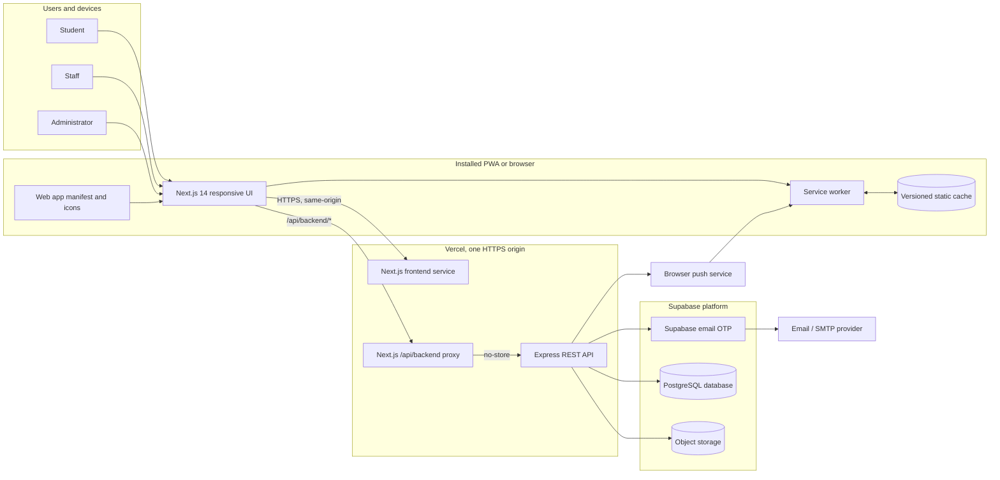
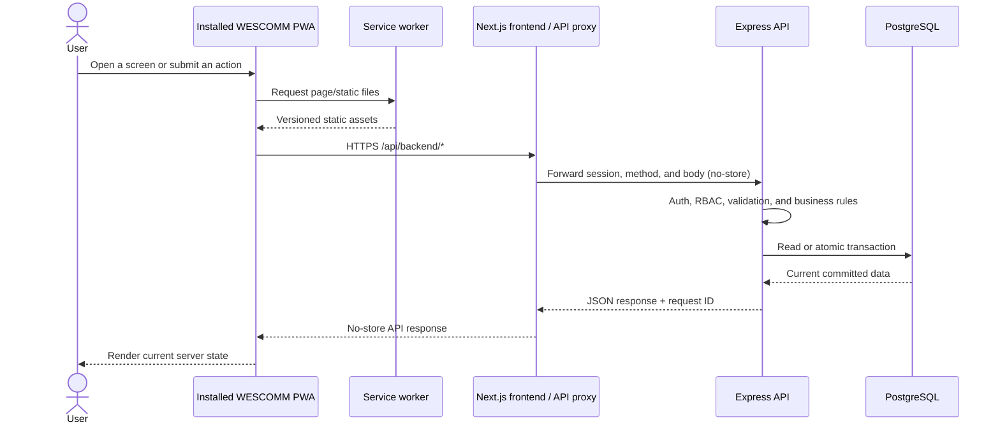
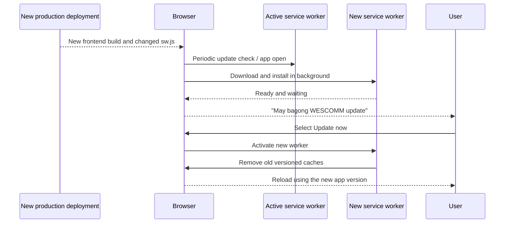

# WESCOMM Installable PWA System Architecture

## 1. Architecture decision

WESCOMM will remain one responsive web application and will be made installable
on supported Android, iPhone/iPad, and desktop browsers as a Progressive Web
App (PWA).

The application will use an **online-first** model:

- Static application files may be cached so the interface loads quickly.
- Products, inventory, reservations, receipts, messages, notifications, user
  profiles, reports, and administrative data always come from the server.
- Creating or updating records requires an internet connection. The first PWA
  version will not queue transactions while offline.
- If the device is offline, WESCOMM shows a clear offline/unavailable screen
  instead of displaying potentially stale private or transactional data.
- A newly deployed version is downloaded in the background and activated after
  the user accepts an update prompt or reopens the application.

This design makes WESCOMM installable without turning it into a separate mobile
codebase and without sacrificing data freshness.

## 2. High-level system context



The current visual overview is also available at
[`system-design-diagrams/01-wescomm-system-architecture.png`](../system-design-diagrams/01-wescomm-system-architecture.png).

## 3. Component responsibilities

| Component | Responsibility |
| --- | --- |
| Next.js frontend | Student, staff, and admin pages; responsive mobile UI; install and update prompts; online/offline status |
| `manifest.webmanifest` | App name, icon, start URL, theme colors, standalone display mode, and install metadata |
| Service worker | Push notifications, versioned static caching, offline fallback, and controlled app-version updates |
| Next.js API proxy | Same-origin browser API entry point; forwards cookies/auth headers; enforces request origin and body-size rules |
| Express API | Authentication/session checks, role authorization, validation, rate limits, business rules, and audit logging |
| PostgreSQL through Prisma | Source of truth for users, products, inventory, reservations, receipts, messages, notifications, and restrictions |
| Supabase Auth | Wesleyan email OTP authentication |
| Supabase Storage | Product and receipt files/images |
| Web Push and VAPID | Reservation, receipt, message, stock, and system notifications |
| Vercel | HTTPS delivery and routing of `/` to Next.js and API traffic to the backend service |

## 4. Normal online data flow



Important transactional operations such as reservations retain server-side
validation, inventory transactions, and idempotency protection. Installing the
PWA does not move those rules to the phone.

## 5. Caching and offline policy

| Resource | Strategy | Offline behavior | Reason |
| --- | --- | --- | --- |
| `/_next/static/*`, fonts, app icons | Cache-first with build/versioned names | Available | Files are immutable for a specific build |
| Public images and other static assets | Stale-while-revalidate with size/age limits | Last cached asset may appear | Improves speed without storing private data |
| Page navigation and authenticated HTML | Network-first; optional offline fallback only | Show offline screen if the network fails | Avoid stale account or role-specific pages |
| `/api/backend/*` and `/api/*` GET requests | Network-only / `no-store` | Show connection error | User and inventory data must remain current |
| POST, PATCH, and DELETE requests | Network-only; never cached | Action remains unsent and user can retry | Prevent duplicate or outdated transactions |
| Authentication/session responses | Network-only; never cached | Login/session validation requires connection | Protect credentials and authorization state |
| Push notification events | Handled by the service worker | Notification can be displayed by the browser | Already supported by the current service worker |

No private API response, cookie, OTP, receipt, reservation, report, or profile
record should be written to the Cache API.

## 6. Application update flow



API data is not tied to a cached app snapshot. After reloading, screens request
the latest server data as normal. For urgent releases, the UI may require an
update before the user continues, but silent mid-transaction reloads should be
avoided.

## 7. Installation behavior

### Android and supported desktop browsers

The application can present an **Install WESCOMM** button when the browser emits
the install event. The browser installs the PWA from the manifest and opens it
in standalone mode.

### iPhone and iPad

The application displays a short guide for **Share > Add to Home Screen**.
Push notification permission must be requested only from a clear user action
and only after installation/support checks succeed.

### Normal browser users

Users who do not install WESCOMM continue using the same URL and the same
responsive application. Installation is optional and does not create a second
account or database.

## 8. Authentication and security boundaries

- All production traffic uses HTTPS.
- The browser talks to the same-origin Next.js API proxy, which forwards to the
  Express API using `cache: no-store`.
- The backend remains the authorization boundary for student, staff, and admin
  roles. The PWA interface is not trusted to enforce permissions by itself.
- Session cookies stay `HttpOnly`, `Secure` in production, and appropriately
  scoped with `SameSite` protection.
- Mutations keep origin/CSRF checks, rate limiting, payload limits, validation,
  database transactions, idempotency, and audit logs.
- VAPID private keys, Supabase service-role keys, database credentials, and
  encryption keys remain backend-only environment variables.
- The service worker must not cache authenticated API responses or sensitive
  documents.

## 9. Deployment topology

The existing one-domain Vercel Services topology remains suitable:

```text
https://wescomm.example.edu/
    / and application routes  -> Next.js frontend service
    /api/backend/*             -> Next.js same-origin API proxy
    backend API                -> Express service
    data/auth/storage          -> Supabase
```

Using one public HTTPS origin simplifies installation, service-worker scope,
cookies, CORS, and CSRF enforcement.

## 10. Implemented state

Implemented in the repository:

- Responsive Next.js 14 App Router frontend
- Express API with Prisma and Supabase
- Same-origin Next.js backend proxy, browser API client, and Express responses
  using `no-store`
- Web app manifest, standalone metadata, verified square icons, maskable icon,
  and Apple touch icon
- Globally registered service worker with a release-specific cache version
- Strict static-asset cache allowlist and a plain offline navigation fallback
- Service-worker push and same-origin notification-click handling
- VAPID push subscription storage and delivery
- Android/desktop install prompt and iOS Add-to-Home-Screen instructions
- Global online/offline status, fail-fast offline API protection, and automatic
  product refresh after reconnect, app resume, and while visible
- User-approved update prompt, old-cache cleanup, and controlled reload
- Push subscription cleanup before logout on shared devices
- Vercel frontend/backend Services routing
- Playwright coverage for manifest/icons, service-worker scope, API cache
  exclusion, offline recovery, install UI, update activation, and the production
  offline fallback

Remaining device/staging validation:

1. Install from the production HTTPS deployment on physical Android and iOS
   devices and confirm standalone launch behavior.
2. Confirm iOS Home Screen push permission and delivery using production VAPID
   keys.
3. Deploy two consecutive staging releases and confirm the real browser update
   prompt preserves an in-progress user flow.

## 11. Acceptance criteria

- WESCOMM can be installed and launched in standalone mode on supported devices.
- All products, stock, reservations, receipts, profiles, messages, reports, and
  administrative data are fetched from the server and are not served from a
  stale service-worker API cache.
- Offline users cannot accidentally submit a transaction that appears saved.
- Returning online allows the user to retry and receive the current server
  state.
- A newly deployed app version is detected and can replace the active version
  without corrupting an in-progress reservation.
- Push notifications continue working through the same service worker.
- Browser-only users retain the same application behavior.

## 12. Explicit non-goals for the first PWA release

- No offline reservation creation or background transaction queue
- No offline admin/staff inventory changes
- No separate Android or iOS native codebase
- No Play Store or App Store packaging yet

If store distribution becomes a requirement later, the same hosted application
can be evaluated for packaging with Capacitor after the PWA behavior is stable.
